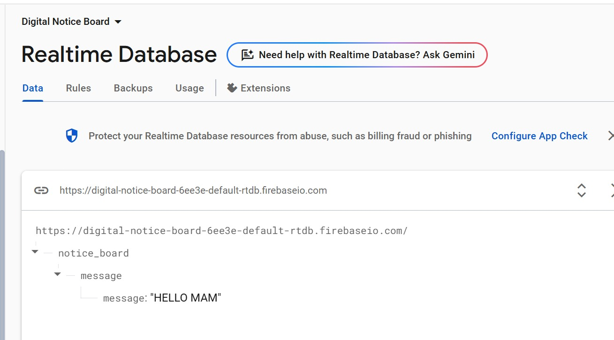
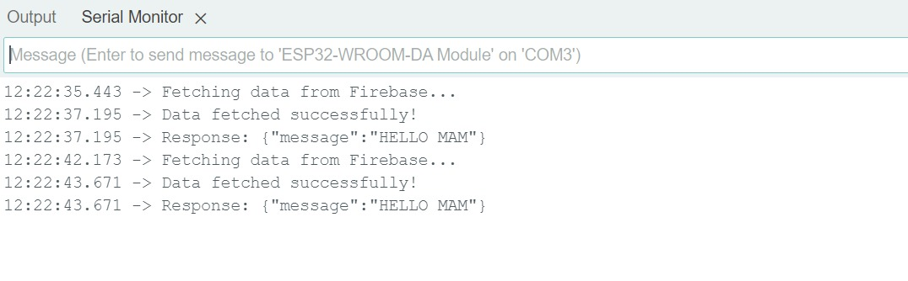
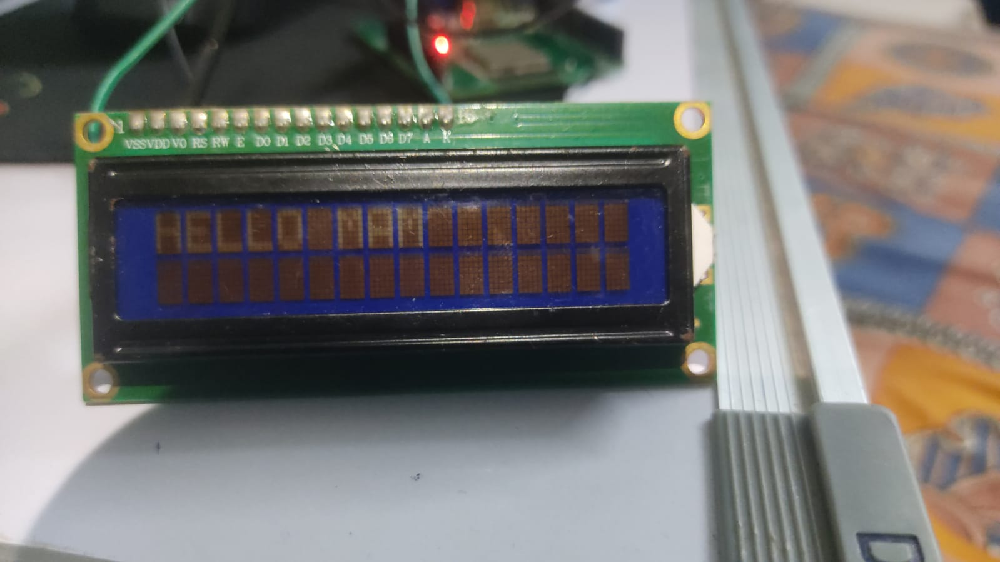

# Digital Notice Board 

This project is a simple and cost-effective digital notice board system using **ESP32**, **Firebase**, and an **LCD display**. It allows notices to be updated remotely in real time — perfect for schools, colleges, or small offices.

---

## What It Does

- Displays real-time messages on a 16x2 LCD
- Connects to Firebase over WiFi
- Fetches updates every 5 seconds
- Buzzer alert on new or urgent messages
- Helps eliminate the need for manually updating traditional notice boards

---

##  Tech Used

- ESP32 microcontroller
- Firebase Realtime Database
- RTC (DS3231)
- 16x2 LCD (I2C)
- Arduino IDE

---

##  How It Works

1. Faculty uploads a message to Firebase
2. ESP32 connects to WiFi and checks Firebase
3. If a new message is found, it’s shown on the LCD
4. Buzzer rings to indicate the update
5. This repeats every few seconds

---

##  Some Screenshots

### Firebase:

### Serial Monitor:

### LCD Output:

---

##  Project Files

- `main.ino` – Arduino code
- `digital notice board report.pdf` – Complete mini project documentation
- Images – Firebase, Serial Monitor, LCD Output

---

##  Future Plans

- Add a web dashboard to manage notices
- Auto-expire old messages
- Schedule notices with date/time
- Maybe build a basic mobile app interface

---

##  About Me

Hi, I’m **Krishna Tuwar**, currently pursuing B.E. in EXTC at VESIT, Mumbai.  
I enjoy building tech that solves simple real-world problems — especially using microcontrollers, IoT, and web tools.

Feel free to connect!

📧 krishnatuwar01@gmail.com
